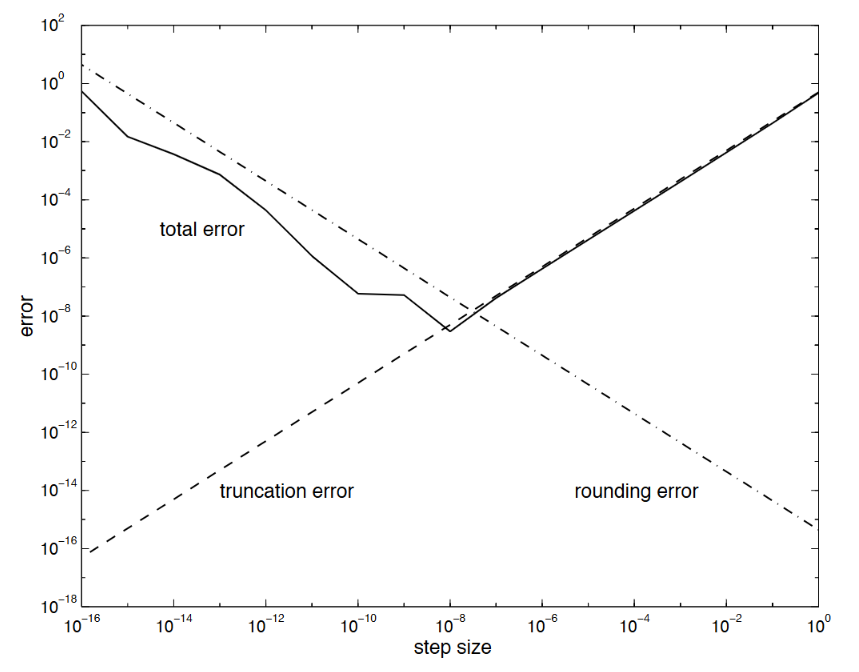
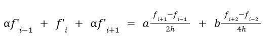

# Finite Differences

## Table of Contents
- [Overview](#Overview)
- [Finite Difference Methods Background and Overview](#Finite-Difference-Methods-Background-and-Overview)
- [Finite Difference Methods Types](#Finite-Difference-Methods-Types)
- [Error Analysis](#Error-Analysis)
- [Finite Difference Methods High Orders](#Finite-Difference-Methods-High-Orders)
- [Compact Finite Differences](#Compact-Finite-Differences)
- [Nonstandard Finite Differences](#Nonstandard-Finite-Differences)
- [Applications and Performance](#Applications-and-Performance)
- [Implementation and Considerations](#Implementation-and-Considerations)
- [References](#References)

## Overview
Finite difference methods (FDM) serve as a cornerstone in numerical analysis, particularly for solving partial differential equations and boundary value problems. These methods effectively transform continuous differential problems into discrete approximations, making them computationally efficient.

The fundamental principle involves replacing continuous derivatives with discrete approximations. This process typically involves converting differential equations into algebraic equations, establishing a grid over the solution domain, and applying appropriate boundary conditions [1].

## Finite-Difference-Methods-Background-and-Overview

Finite differences approximate derivatives by replacing continuous differential operators with discrete approximations over a mesh or grid. The accuracy and stability of these approximations depend on both the spatial mesh size and temporal step size when dealing with time-dependent problems [2].

### Mathematical Foundation
For a given function *f(x)*, the derivative *f'(x)* with $x = a$ is defined as: 

$$f'(a) = \lim_{x \to a} \frac{f(x) - f(a)}{x - a}$$

This definition represents the instantaneous rate of change or the slope of the function at the point *x = a*. Finite difference methods aim to approximate this slope using function values in the neighborhood of the point a. 

### Taylor Series Expansion
The theoretical basis for finite difference approximations lies in the *Taylor series expansion*. For a function *f(x)* expanded around the point *x = a*, we have:

$$f(x) = f(a) + f'(a)(x - a) + \frac{f''(a)}{2!}(x - a)^2 + \frac{f'''(a)}{3!}(x - a)^3 + ...$$

Rearranging this series to isolate *f'(a)* yields:

$$f'(a) = \frac{f(x) - f(a)}{x - a} - \frac{f''(a)}{2!}(x - a) - \frac{f'''(a)}{3!}(x - a)^2 - ...$$

This rearrangement forms the basis for various finite difference approximations.

### Discretization Process
In practice, finite difference methods involve discretizing the domain of interest into a grid or mesh. The continuous derivatives in differential equations are then replaced by discrete approximations using function values at these grid points. The choice of grid points and the way these approximations are constructed lead to different types of finite difference schemes.

### Error Analysis Overview
The truncation of the Taylor series in finite difference approximations introduces errors. The magnitude of these errors depends on the step size and the order of the approximation. Generally, smaller step sizes lead to more accurate approximations, but at the cost of increased computational effort.

## Finite-Difference-Methods-Types

### Forward Differences
For forward differences with step size *h*, we can express the Taylor expansion series as:

$$ f(x + h) = f(x) + hf'(x) + \frac{h^2}{2!}f''(x) + \frac{h^3}{3!}f'''(x) + ...$$

Rearranging this series to isolate *f'(x)* yields:

$$ f'(x) = \frac{f(x+h) - f(x)}{h} - \frac{h}{2}f''(x) - \frac{h^2}{6}f'''(x) + O(h^3) \approx \frac{f(x+h) - f(x)}{h}$$

## Backward Difference
For backward differences with step size *h*, we can express the Taylor expansion series as:

$$ f(x - h) = f(x) - hf'(x) + \frac{h^2}{2!}f''(x) - \frac{h^3}{3!}f'''(x) + ...$$

Rearranging this series to isolate *f'(x)* yields:

$$ f'(x) = \frac{f(x) - f(x-h)}{h} + \frac{h}{2}f''(x) - \frac{h^2}{6}f'''(x) + O(h^3) \approx \frac{f(x) - f(x-h)}{h}$$

### Central Differences
For central differences with step size *h*, we can express the Taylor expansion series in both forward and backward directions:

$$ f(x + h) = f(x) + hf'(x) + \frac{h^2}{2!}f''(x) + \frac{h^3}{3!}f'''(x) + \frac{h^4}{4!}f^{(4)}(x) + ... $$
$$ f(x - h) = f(x) - hf'(x) + \frac{h^2}{2!}f''(x) - \frac{h^3}{3!}f'''(x) + \frac{h^4}{4!}f^{(4)}(x) + ... $$

Subtracting these equations and rearranging to isolate *f'(x)* yields:

$$ f'(x) = \frac{f(x+h) - f(x-h)}{2h} - \frac{h^2}{6}f'''(x) + O(h^4) \approx \frac{f(x+h) - f(x-h)}{2h} $$

## Error-Analysis
### Basic Truncation Error Analysis
The truncation error (TE) for forward and backward difference methods comes directly from the Taylor series expansion:

$$ \text{TE} = -\frac{h}{2}f''(x) - \frac{h^2}{6}f'''(x) + O(h^3) $$

where *h* is the step size. Thus, the truncation error is bounded by *Mh*, where *M* bounds $|f''(t)|$ for *t* near *x*.

For central difference methods,

$$ \text{TE} = -\frac{h^2}{6}f'''(x) + O(h^4) $$

where *h* is the step size. Thus, the truncation error is bounded by $Mh^2$, where M bounds $|f'''(t)|$ for *t* near *x*.


### Basic Rounding Error Analysis
The rounding error (RE) for above finite difference methods is bounded by:

$$ \text{RE} \leq \frac{2\epsilon}{h} $$

where ε (epsilon) is the bound on errors in function values and *h* is the step size

### Basic Error Minimization Analysis
The total error in forward and backward difference approximation combines both truncation and rounding errors regarding step size *h*:

$$ \text{Total Error} = O(h) + O(\frac{\epsilon}{h}) $$

Let's say the truncation error is bounded by *Mh*, where *M* bounds $|f''(t)|$ for *t* near *x* and the rounding error by $\frac{2 \epsilon}{h}$. Then:

$$ \text{Total Error} = Mh + \frac{2\epsilon}{h} $$

To find the minimum, we differentiate with respect to *h* and set the diffrentiation equation to zero:

$$ \frac{d}{dh}(\text{Total Error}) = M - \frac{2\epsilon}{h^2} = 0 $$

Solving for *h* yields:

$$ h = \sqrt{\frac{2\epsilon}{M}} $$

Similarly, the total error for central difference approximation regarding step size *h*:

$$ \text{Total Error} = Mh^2 + \frac{2\epsilon}{h} $$

To find the minimum, we differentiate with respect to *h* and set the diffrentiation equation to zero:

$$ \frac{d}{dh}(\text{Total Error}) = 2Mh - \frac{2\epsilon}{h^2} = 0 $$

Solving for h yields the optimal step size:

$$ h = \sqrt[3]{\frac{\epsilon}{M}} $$

This value of *h* represents the optimal step size that balances truncation and rounding errors, minimizing the total error in forward difference approximations.

In numerical approximations of derivatives using finite differences, there exists a fundamental trade-off between truncation and rounding errors. As the step size *h* decreases, the truncation error diminishes, with first derivatives showing error proportional to *h* (or $h^2$). This initial reduction in step size leads to more accurate approximations. However, this improvement has a practical limit due to rounding errors, which are bounded by $\frac{2ε}{h}$, where ε represents machine precision. When *h* becomes sufficiently small, the rounding error begins to dominate the total error, effectively negating the benefits of reduced truncation error.

This limitation becomes particularly pronounced when computing higher-order derivatives. Higher-order approximations are more susceptible to numerical instability as *h* decreases, encountering computational difficulties sooner than lower-order derivatives. This increased sensitivity stems from the amplification of rounding errors through successive derivative calculations, making the computation of higher-order derivatives inherently more challenging in numerical implementations. The balance between these competing error sources necessitates careful selection of step size, especially when dealing with higher-order derivatives where the window of optimal step sizes becomes increasingly narrow.



## Finite-Difference-Methods-High-Orders
### Forward Difference for Second Derivatives
Start with Taylor expansions for two forward points:

$$ f(x + h) = f(x) + hf'(x) + \frac{h^2}{2!}f''(x) + \frac{h^3}{3!}f'''(x) + \frac{h^4}{4!}f^{(4)}(x) + O(h^5) $$

$$ f(x + 2h) = f(x) + 2hf'(x) + \frac{4h^2}{2!}f''(x) + \frac{8h^3}{3!}f'''(x) + \frac{16h^4}{4!}f^{(4)}(x) + O(h^5) $$

To eliminate f'(x), multiply the first equation by -2 and add to the second equation:

$$ -2f(x + h) + f(x + 2h) = -2f(x) - 2hf'(x) - h^2f''(x) - \frac{2h^3}{3!}f'''(x) - \frac{2h^4}{4!}f^{(4)}(x) + $$
$$ f(x) + 2hf'(x) + 2h^2f''(x) + \frac{8h^3}{3!}f'''(x) + \frac{16h^4}{4!}f^{(4)}(x) + ...$$

Rearranging and solving for f''(x):

$$ f''(x) = \frac{f(x+2h) - 2f(x+h) + f(x)}{h^2} + O(h) $$

### Backward Difference for Second Derivatives

Start with Taylor expansions for two backward points:

$$ f(x - h) = f(x) - hf'(x) + \frac{h^2}{2!}f''(x) - \frac{h^3}{3!}f'''(x) + \frac{h^4}{4!}f^{(4)}(x) + O(h^5) $$

$$ f(x - 2h) = f(x) - 2hf'(x) + \frac{4h^2}{2!}f''(x) - \frac{8h^3}{3!}f'''(x) + \frac{16h^4}{4!}f^{(4)}(x) + O(h^5) $$

To eliminate f'(x), multiply the first equation by -2 and add to the second equation:

$$ -2f(x - h) + f(x - 2h) = -2f(x) + 2hf'(x) - h^2f''(x) + \frac{2h^3}{3!}f'''(x) - \frac{2h^4}{4!}f^{(4)}(x) + $$
$$ f(x) - 2hf'(x) + 2h^2f''(x) - \frac{8h^3}{3!}f'''(x) + \frac{16h^4}{4!}f^{(4)}(x) + ... $$

Rearranging and solving for f''(x):

$$ f''(x) = \frac{f(x-2h) - 2f(x-h) + f(x)}{h^2} + O(h) $$

This gives us the backward difference approximation for the second derivative with first-order accuracy, similar to the forward difference case.

### Central Difference for Second Derivatives
Start with Taylor expansions for two forward points:

$$ f(x + h) = f(x) + hf'(x) + \frac{h^2}{2!}f''(x) + \frac{h^3}{3!}f'''(x) + \frac{h^4}{4!}f^{(4)}(x) + ...$$

$$ f(x - h) = f(x) - hf'(x) + \frac{h^2}{2!}f''(x) - \frac{h^3}{3!}f'''(x) + \frac{h^4}{4!}f^{(4)}(x) - ...$$

To eliminate f'(x), add the first equation to the second equation:

$$ f(x + h) + f(x - h) = 2f(x) + h^2f''(x) + \frac{2h^4}{4!}f^{(4)}(x) + ...$$

Rearranging and solving for f''(x):

$$ f''(x) = \frac{f(x+h) - 2f(x+h) + f(x-h)}{h^2} + O(h^4)$$

### Higher-Order Finite Difference Approximation
The higher order finite difference approximation is addressed in [*Numerical Resolution of Differential Equations Using the Finite Difference Method in the Real and Complex Domain*](https://www.mdpi.com/2227-7390/12/12/1870) by Almeida Magalhães et al. [3]. This research extends the traditional real-domain approximations to a quadrant approximation in the complex plane, providing comprehensive coverage of real and complex finite difference equations along with their respective error orders, making it a valuable reference for engineering applications [3].

## Compact-Finite-Differences
Compact finite difference schemes, also known as Padé schemes, provide high-order accuracy using smaller stencils compared to explicit schemes. These methods achieve this by solving an implicit system of equations for the derivatives.

### Mathematical Formulation
A typical fourth-order compact scheme for first derivatives takes the form [4]:

 

where α is the scheme parameter, *a* and *b* are coefficients chosen for desired accuracy, and *h* is the step size.

### Advantages
The Compact Finite Difference Scheme offers several significant advantages in numerical computations. From a resolution perspective, it demonstrates spectral-like characteristics, providing enhanced resolution of high-frequency components while significantly reducing numerical dispersion [4]. This results in notably improved accuracy per step size compared to traditional methods. On the computational front, the scheme's efficiency stems from its compact structure, utilizing a smaller stencil size than explicit schemes [4]. This compact nature not only simplifies the handling of boundary conditions but also contributes to improved stability properties, making it particularly valuable for complex numerical simulations.


## Nonstandard-Finite-Differences
Nonstandard finite difference (NSFD) methods represent a specialized class of numerical techniques designed to overcome limitations of traditional schemes in specific problem domains, which are particularly valuable when dealing with dynamical systems in biology, physics, and engineering where preserving certain mathematical properties is crucial. 

NSFD methods excel at maintaining essential qualitative features of the original differential equations, such as positivity of solutions, boundedness, and stability properties near equilibrium points [5]. They have demonstrated remarkable success in handling productive-destructive systems and autonomous dynamical systems, offering both computational efficiency and straightforward implementation [5].

A key strength of NSFD methods lies in their ability to preserve the global asymptotic stability of equilibrium points through the maintenance of quadratic Lyapunov functions, regardless of step size selection[6]. This characteristic makes them particularly effective for solving complex problems like the Burgers-Huxley equation, where maintaining solution positivity, boundedness, and monotonicity is essential[6].

The practical implementation of NSFD methods involves careful construction of discrete models that preserve the essential mathematical and physical properties of the continuous systems they approximate [6]. 

## Applications-and-Performance

**Strengths**
- Simple implementation and intuitive understanding
- Efficient for regular geometries
- Well-suited for parallel computing

**Limitations**
- Accuracy depends heavily on grid resolution
- May struggle with complex geometries
- Can face stability issues in certain conditions

## Implementation-and-Considerations

**Stability Conditions**
The CFL (Courant-Friedrichs-Lewy) condition must be satisfied for explicit time-stepping schemes to maintain stability[7]. For example, in wave equations:
$$ \Delta t \leq C \frac{\Delta x}{v} $$
where C is the Courant number and v is the wave speed.

**Algorithm Selection Guidelines**
- Use central differences for general-purpose applications requiring moderate accuracy
- Consider compact schemes when high accuracy is needed with minimal computational overhead
- Apply nonstandard methods for problems with special properties that need preservation

**Pseudocode for Basic Implementation**
```python
def central_difference_2nd_order(f, x, h):
    return (f[x + 1] - 2*f[x] + f[x - 1]) / (h*h)
```

The choice of finite difference method should be guided by the specific requirements of the problem, including accuracy needs, computational resources, and the nature of the solution being sought.

## References:
1. Thomée, V. (2001). From finite differences to finite elements a short history of numerical analysis of partial differential equations. Journal of Computational and Applied Mathematics, 128, 1-54. https://www.sciencedirect.com/science/article/pii/S0377042700005070?via%3Dihub
2. Thomas, J.W. (1997) Numerical Partial Differential Equations: Finite Difference Methods. Springer-Verlag, Berlin.
3. Almeida Magalhães, A.L.M., Brito, P.P., Lamon, G.P.d.S., Júnior, P.A.A.M., Magalhães, C.A., Almeida Magalhães P.H.M., Magalhães P.A.A. (2024). Numerical Resolution of Differential Equations Using the Finite Difference Method in the Real and Complex Domain. Mathematics. 12(12):1870. https://doi.org/10.3390/math12121870
4. Lele, S.K. (1992). Compact finite difference schemes with spectral-like resolution. Journal of Computational Physics. 103, 1:16-42. https://doi.org/10.1016/0021-9991(92)90324-R.
5. Kojouharov, H.V. (2015). Nonstandard Finite-Difference Methods for Dynamical Systems in Biology. Biomath Communications, 2. https://api.semanticscholar.org/CorpusID:119476395
6. Hoang, M.T. (2023). Nonstandard finite difference methods preserving general quadratic Lyapunov functions. arXiv: Numerical Analysis. https://arxiv.org/abs/2312.01471
7. Loeb, D.E., & Rota, G. (1995). Recent contributions to the calculus of finite differences: a survey. arXiv: Combinatorics. https://doi.org/10.48550/arXiv.math/9502210
8. Bournez, O. (2019). Complexity theory with Discrete Differential Equations/Finite differences. https://api.semanticscholar.org/CorpusID:14799803
